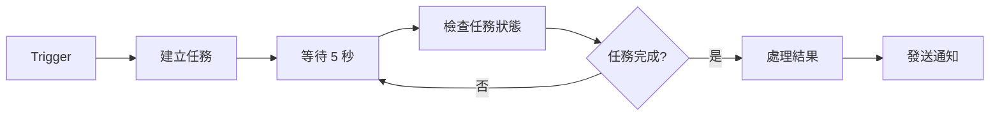

# AI Ops Assistant Gemini - n8n API 調用指南

本指南專為 n8n 工作流自動化平台使用者設計，提供完整的 AI Ops Assistant Gemini 後端 API 調用說明和實際範例。

## 📋 目錄

1. [系統概覽](#系統概覽)
2. [網路配置說明](#網路配置說明)
3. [API 端點文檔](#api-端點文檔)
4. [n8n 整合範例](#n8n-整合範例)
5. [實用工作流程](#實用工作流程)
6. [錯誤處理指南](#錯誤處理指南)
7. [最佳實踐建議](#最佳實踐建議)

---

## 系統概覽

AI Ops Assistant Gemini 是基於 FastAPI 框架的網路維運自動化系統，提供：

- **網路設備指令執行**: 批次執行 SSH 指令到多台網路設備
- **AI 智能分析**: 使用 Gemini/Claude 進行網路狀態分析
- **設備管理**: 設備清單、群組管理和健康檢查
- **任務追蹤**: 異步任務執行和狀態監控

### 技術架構
- **前端**: React + TypeScript
- **後端**: FastAPI + Python 
- **代理**: Traefik (反向代理和負載均衡)
- **容器化**: Docker + Docker Compose

---

## 網路配置說明

### 存取端點

| 服務 | 外部存取 URL | 說明 |
|------|-------------|------|
| **主應用** | `http://202.3.184.82/` | 前端使用者介面 |
| **API 端點** | `http://202.3.184.82/api/` | RESTful API 基礎路径 |
| **健康檢查** | `http://202.3.184.82/health` | 系統狀態檢查 |
| **Traefik 管理** | `http://202.3.184.82:81/` | 代理伺服器管理面板 |
| **n8n 入口** | `http://202.3.184.82:8001/` | n8n 工作流平台 |

### 網路架構
```
外部用戶 → 202.3.184.82 (外部IP) → NAT → 10.60.21.11 (內部IP) → Docker 容器
```

### 開放端口
- **80**: HTTP 主要服務
- **81**: Traefik 管理面板
- **8001**: n8n 平台
- **22**: SSH 管理
- **443**: HTTPS (未啟用)

---

## API 端點文檔

### 基礎資訊
- **基礎 URL**: `http://202.3.184.82/api`
- **Content-Type**: `application/json`
- **Accept**: `application/json`
- **User-Agent**: `n8n-workflow/1.0`
- **回應格式**: 標準化 JSON 格式 (符合 FastAPI 規範)

**成功回應格式**:
```json
{
  "success": true,
  "data": "<回應資料>",
  "message": "操作成功完成",
  "error_code": null,
  "timestamp": "2025-08-24T10:30:15.123456"
}
```

**錯誤回應格式**:
```json
{
  "success": false,
  "data": null,
  "message": "錯誤描述",
  "error_code": "SPECIFIC_ERROR_CODE",
  "timestamp": "2025-08-24T10:30:15.123456"
}
```

**HTTP 狀態碼規範**:
- `200 OK`: 請求成功
- `201 Created`: 資源建立成功 
- `400 Bad Request`: 請求參數錯誤
- `401 Unauthorized`: 認證失敗
- `403 Forbidden`: 權限不足
- `404 Not Found`: 資源不存在
- `422 Unprocessable Entity`: 資料驗證失敗
- `500 Internal Server Error`: 伺服器內部錯誤

### 標準異步任務處理流程

本 API 採用標準的異步任務處理模式，確保大量設備操作不會阻塞請求。以下是完整的處理流程：

#### 🔄 異步處理流程概覽

```mermaid
graph LR
    A[POST /api/tasks] --> B[立即返回 task_id]
    B --> C[任務在背景執行]
    C --> D[GET /api/tasks/{task_id}]
    D --> E{status 檢查}
    E -->|pending/running| D
    E -->|completed/failed| F[獲取結果]
```

#### 📋 詳細處理步驟

**第一步：建立任務 (POST)**
```http
POST /api/tasks
Content-Type: application/json
```

**第二步：提取 task_id**
```json
{
  "success": true,
  "data": {
    "task_id": "4706ef27-7d69-4073-ba9b-d997090a8fd9",  👈 重要：提取此 ID
    "status": "pending",
    "created_at": "2025-08-24T15:08:30",
    "polling_url": "/api/tasks/4706ef27-7d69-4073-ba9b-d997090a8fd9"
  }
}
```

**第三步：輪詢任務狀態 (GET)**
```http
GET /api/tasks/{task_id}  👈 使用上步獲得的 task_id
```

**第四步：檢查狀態直到完成**
- `pending`: 任務排隊等待中
- `running`: 任務執行中
- `completed`: 任務成功完成 → 查看 `results` 欄位
- `failed`: 任務執行失敗 → 查看 `error` 欄位

#### 🎯 關鍵注意事項

1. **task_id 提取路徑**：`$json.data.task_id` (n8n 中)
2. **輪詢間隔建議**：5-10 秒一次
3. **最大輪詢時間**：建議設定 5-10 分鐘超時
4. **狀態判斷條件**：`status === "completed" || status === "failed"`

---

### 1. 任務管理 API

#### 建立任務
```http
POST /api/tasks
Content-Type: application/json
```

##### 📋 請求參數結構

```json
{
  "operation_type": "device_command" | "ai_query",  // 必填
  "devices": ["IP1", "IP2", ...],                   // 必填：目標設備IP陣列
  "command": "指令內容",                            // device_command時必填
  "query": "AI查詢內容",                            // ai_query時必填
  "webhook_url": "http://callback-url"               // 可選：完成時回調URL
}
```

##### 📊 參數詳細說明

| 參數名稱 | 類型 | 必填 | 說明 | 範例 |
|---------|------|------|------|------|
| `operation_type` | string | ✅ | 操作類型：`device_command` 或 `ai_query` | `"device_command"` |
| `devices` | array[string] | ✅ | 目標設備的IP位址列表，至少包含一個IP | `["192.168.1.1", "192.168.1.2"]` |
| `command` | string | 條件必填 | device_command操作時必填，要執行的SSH指令 | `"show interfaces brief"` |
| `query` | string | 條件必填 | ai_query操作時必填，AI分析的查詢內容 | `"分析設備健康狀態"` |
| `webhook_url` | string | ❌ | 任務完成時的回調URL，支援HTTP/HTTPS | `"http://callback.example.com/webhook"` |

##### 🔧 兩種操作類型詳解

**1. device_command - 設備指令執行**
透過SSH連線執行指令到指定的網路設備

```json
{
  "operation_type": "device_command",
  "devices": ["192.168.1.1", "192.168.1.2", "192.168.1.10"],
  "command": "show version; show interfaces brief; show ip route summary",
  "webhook_url": "http://202.3.184.82:8001/webhook/device-command-complete"
}
```

支援的指令類型：
- 單一指令：`"show version"`
- 多重指令：`"show version; show interfaces; show environment"`
- 複雜查詢：`"show interfaces | include up; show logging | tail 20"`

**2. ai_query - AI智能分析**
使用Gemini/Claude AI進行網路維運分析

```json
{
  "operation_type": "ai_query",
  "devices": ["192.168.1.1"],
  "query": "根據show version和show interfaces的輸出，分析這台設備的健康狀態，提供維運建議和潛在問題預警",
  "webhook_url": "http://202.3.184.82:8001/webhook/ai-analysis-complete"
}
```

AI查詢建議：
- 狀態分析：`"分析設備當前運行狀態並提供維運建議"`
- 問題診斷：`"診斷網路連通性問題的可能原因"`
- 效能評估：`"評估設備效能指標並建議優化措施"`
- 安全檢查：`"檢查設備安全配置並提供加固建議"`

##### 📤 請求範例

**基本範例**:
```json
{
  "operation_type": "device_command",  // 或 "ai_query"
  "devices": ["192.168.1.1", "192.168.1.2"],
  "command": "show version",           // device_command 必填
  "query": "分析設備狀態",            // ai_query 必填
  "webhook_url": "http://202.3.184.82:8001/webhook/ai-ops"  // 可選
}
```

**回應範例**:
```json
{
  "success": true,
  "data": {
    "task_id": "4706ef27-7d69-4073-ba9b-d997090a8fd9",  👈 n8n 提取路徑: $json.data.task_id
    "status": "pending",
    "created_at": "2025-08-24T15:08:30.328456",
    "polling_url": "/api/tasks/4706ef27-7d69-4073-ba9b-d997090a8fd9"
  },
  "message": "任務建立成功",
  "timestamp": "2025-08-24T15:08:30.341456"
}
```

**⚠️ 重要提醒**：
- **task_id 必須保存**：後續輪詢狀態時必須使用
- **n8n 提取方式**：使用表達式 `{{ $json.data.task_id }}`
- **任務立即開始**：API 回應後任務即在背景執行

#### 查詢任務狀態
```http
GET /api/tasks/{task_id}  👈 使用從建立任務回應中獲得的 task_id
```

**URL 建構範例**：
- 完整 URL：`http://202.3.184.82/api/tasks/4706ef27-7d69-4073-ba9b-d997090a8fd9`
- n8n 表達式：`http://202.3.184.82/api/tasks/{{ $json.data.task_id }}`

**回應範例**:
```json
{
  "success": true,
  "data": {
    "task_id": "task_20250824_103015_abc123",
    "status": "completed",
    "operation_type": "device_command",
    "created_at": "2025-08-24T10:30:15.123456",
    "started_at": "2025-08-24T10:30:16.123456",
    "completed_at": "2025-08-24T10:30:45.123456",
    "progress": {
      "current_step": "任務執行完成",
      "total_devices": 2,
      "processed_devices": 2,
      "success_count": 2,
      "error_count": 0
    },
    "results": {
      "summary": {
        "successful_devices": 2,
        "failed_devices": 0,
        "execution_time": 29.5
      },
      "device_results": {
        "192.168.1.1": {
          "success": true,
          "output": "Cisco IOS Software, Version 15.1...",
          "execution_time": 12.3
        },
        "192.168.1.2": {
          "success": true,
          "output": "Cisco IOS Software, Version 16.9...",
          "execution_time": 17.2
        }
      }
    },
    "error": null
  },
  "message": "任務執行完成"
}
```

### 2. 設備管理 API

#### 取得設備清單
```http
GET /api/devices
```

**回應範例**:
```json
{
  "success": true,
  "data": [
    {
      "ip": "192.168.1.1",
      "name": "核心交換器-01",
      "location": "機房 A",
      "device_type": "switch",
      "is_enabled": true
    },
    {
      "ip": "192.168.1.2",
      "name": "邊緣路由器-01",
      "location": "機房 B",
      "device_type": "router",
      "is_enabled": true
    }
  ],
  "message": "成功取得 2 台設備"
}
```

#### 取得設備群組
```http
GET /api/device-groups
```

**回應範例**:
```json
{
  "success": true,
  "data": [
    {
      "group_name": "核心網路",
      "devices": ["192.168.1.1", "192.168.1.2"],
      "description": "核心網路設備群組"
    },
    {
      "group_name": "邊緣設備",
      "devices": ["192.168.1.10", "192.168.1.11"],
      "description": "邊緣接入設備群組"
    }
  ],
  "message": "成功取得 2 個群組"
}
```

#### 設備狀態檢查
```http
GET /api/devices/status
```

**回應範例**:
```json
{
  "success": true,
  "data": [
    {
      "device_ip": "192.168.1.1",
      "device_name": "核心交換器-01",
      "is_healthy": true,
      "response_time_ms": 45.2,
      "checked_at": "2025-08-24T10:30:15.123456"
    },
    {
      "device_ip": "192.168.1.2",
      "device_name": "邊緣路由器-01",
      "is_healthy": false,
      "response_time_ms": null,
      "checked_at": "2025-08-24T10:30:15.123456"
    }
  ],
  "message": "設備狀態檢查完成: 1/2 台設備正常"
}
```

### 3. AI 服務 API

#### AI 服務狀態
```http
GET /api/ai-status
```

**回應範例**:
```json
{
  "success": true,
  "data": {
    "ai_initialized": true,
    "api_keys": {
      "gemini_configured": true,
      "claude_configured": true,
      "current_provider": "gemini"
    },
    "recommendations": [],
    "current_provider": "gemini"
  },
  "message": "AI 服務狀態檢查完成"
}
```

### 4. 系統監控 API

#### 健康檢查
```http
GET /health
```

**回應範例**:
```json
{
  "status": "healthy",
  "timestamp": "2025-08-24T10:30:15.123456"
}
```

### 5. 管理員 API（需要認證）

#### API Key 認證說明

管理員 API 需要在請求標頭中提供 `X-API-Key` 認證：

**認證方式**:
```http
X-API-Key: Cisc0123
```

**認證失敗回應**（HTTP 401）:
```json
{
  "detail": "缺少 X-API-Key 標頭"
}
```

或

```json
{
  "detail": "無效的 API Key"
}
```

#### 任務統計資料
```http
GET /api/admin/tasks/stats
X-API-Key: Cisc0123
```

**回應範例**:
```json
{
  "success": true,
  "data": {
    "total_tasks": 156,
    "pending_tasks": 3,
    "running_tasks": 2,
    "completed_tasks": 145,
    "failed_tasks": 6,
    "last_updated": "2025-08-24T10:30:15.123456"
  },
  "message": "任務統計查詢成功",
  "timestamp": "2025-08-24T10:30:15.123456"
}
```

**資料欄位說明**:
- `total_tasks`: 系統中的總任務數
- `pending_tasks`: 等待執行的任務數
- `running_tasks`: 正在執行的任務數
- `completed_tasks`: 已完成的任務數
- `failed_tasks`: 執行失敗的任務數
- `last_updated`: 統計資料更新時間

---

## n8n 整合範例

### 基礎 HTTP Request 節點配置 (符合 n8n 官方規範)

在 n8n 中使用 HTTP Request 節點調用 API：

**基本配置**:
```
節點類型: HTTP Request
認證: None (或選擇相應的認證類型)
方法: POST
URL: http://202.3.184.82/api/tasks
```

**標頭設定**:
```
傳送標頭: 開啟
指定標頭: Using Fields Below
  - Name: Content-Type
    Value: application/json
  - Name: Accept  
    Value: application/json
  - Name: User-Agent
    Value: n8n-workflow/1.0
```

**請求主體配置**:
```
傳送主體: 開啟
主體內容類型: JSON
指定主體: Using JSON
```

**JSON 主體範例**:
```json
{
  "operation_type": "device_command",
  "devices": ["192.168.1.1", "192.168.1.2"],
  "command": "show interfaces brief"
}
```

### 1. 設備指令執行工作流程



**步驟 1: 建立任務**
**HTTP Request 節點配置** (建立任務):
```
節點名稱: 建立 AI 網路任務
節點類型: HTTP Request
認證: None
方法: POST
URL: http://202.3.184.82/api/tasks

標頭設定:
  傳送標頭: 開啟
  指定標頭: Using Fields Below
    - Name: Content-Type, Value: application/json
    - Name: Accept, Value: application/json

請求主體:
  傳送主體: 開啟
  主體內容類型: JSON
  指定主體: Using JSON
  JSON: 
  {
    "operation_type": "device_command",
    "devices": {{ $json.device_list }},
    "command": {{ $json.command }}
  }
```

**步驟 2: 狀態輪詢配置** ⭐ **關鍵步驟**
```
節點名稱: 輪詢任務狀態
節點類型: HTTP Request
認證: None
方法: GET
URL: http://202.3.184.82/api/tasks/{{ $json.data.task_id }}  👈 重要：從前一節點提取 task_id

標頭設定:
  傳送標頭: 開啟
  指定標頭: Using Fields Below
    - Name: Accept, Value: application/json
    - Name: User-Agent, Value: n8n-task-poller/1.0

選項設定:
  超時: 10000 (10秒)
  包含回應標頭和狀態: 開啟
  永不出錯: 關閉
```

**⚠️ 常見錯誤**：
- ❌ 錯誤：`{{ $json.task_id }}`（缺少 data 層級）
- ✅ 正確：`{{ $json.data.task_id }}`

**步驟 3: 條件判斷配置**
```
節點名稱: 檢查任務是否完成
節點類型: IF
條件: {{ $json.data.status === "completed" || $json.data.status === "failed" }}

True 分支: 任務完成 → 處理結果
False 分支: 任務進行中 → 等待後繼續輪詢
```

**步驟 4: 等待節點配置** (連接到 False 分支)
```
節點名稱: 等待後重新輪詢  
節點類型: Wait
等待時間: 5 seconds
繼續至: 步驟 2 (輪詢任務狀態)
```

**輪詢邏輯流程**：
```
建立任務 → 輪詢狀態 → 判斷完成？
                ↑          ↓
                否 ← 等待5秒 ← 否
                            ↓
                          是 → 處理結果
```

### 2. AI 分析工作流程

```yaml
建立 AI 分析任務:
  HTTP Request:
    Method: POST
    URL: http://202.3.184.82/api/tasks
    Body:
      {
        "operation_type": "ai_query",
        "devices": ["192.168.1.1"],
        "query": "分析這台設備的 show version 和 show interfaces 輸出，提供維運建議"
      }
```

### 3. 批次設備健康檢查

**設備狀態檢查配置**:
```
節點名稱: 批次設備健康檢查
節點類型: HTTP Request
認證: None
方法: GET
URL: http://202.3.184.82/api/devices/status

標頭設定:
  傳送標頭: 開啟
  指定標頭: Using Fields Below
    - Name: Accept, Value: application/json
    - Name: User-Agent, Value: n8n-health-check/1.0

選項設定:
  回應: 
    包含回應標頭和狀態: 開啟
    永不出錯: 關閉 (讓 4xx/5xx 狀態碼觸發錯誤)
  超時: 30000 (毫秒)
```

**處理結果 JavaScript 節點**:
```javascript
// 節點名稱: 處理健康檢查結果
// 節點類型: Code
// 語言: JavaScript

// 獲取上一個節點的所有數據
const items = $input.all();
const healthData = items[0].json.data;

// 篩選不健康的設備
const unhealthyDevices = healthData.filter(device => !device.is_healthy);

if (unhealthyDevices.length > 0) {
  return {
    json: {
      alert: true,
      status: "warning",
      unhealthy_count: unhealthyDevices.length,
      total_devices: healthData.length,
      unhealthy_devices: unhealthyDevices.map(device => ({
        name: device.device_name,
        ip: device.device_ip,
        last_check: device.checked_at
      })),
      message: `發現 ${unhealthyDevices.length} 台設備離線或異常`
    }
  };
}

return {
  json: {
    alert: false,
    status: "healthy", 
    unhealthy_count: 0,
    total_devices: healthData.length,
    message: "所有設備運行正常"
  }
};
```

### 4. Webhook 回調處理

在任務建立時設定 webhook URL：

```json
{
  "operation_type": "device_command",
  "devices": ["192.168.1.1"],
  "command": "show version",
  "webhook_url": "http://202.3.184.82:8001/webhook/ai-ops-callback"
}
```

**在 n8n 中設置 Webhook 節點接收回調**:
```
節點名稱: AI Ops 任務完成回調
節點類型: Webhook

基本配置:
  HTTP Method: POST
  Path: ai-ops-callback
  回應: When Last Node Finishes
  回應資料: First Entry JSON

選項配置:
  認證: None (或選擇 Header Auth 等安全選項)
  忽略機器人: 開啟
  IP 白名單: 202.3.184.82 (只允許 API 伺服器回調)
  回應標頭: 
    - Name: Content-Type, Value: application/json
    - Name: X-Webhook-Source, Value: ai-ops-assistant
```

**Webhook 路徑範例**:
- Production: `http://202.3.184.82:8001/webhook/ai-ops-callback`
- Test: `http://202.3.184.82:8001/webhook-test/ai-ops-callback`

---

## 實用工作流程

### 1. 網路設備例行檢查工作流程

**目標**: 每日自動檢查所有網路設備狀態並生成報告

**工作流程詳細配置**:

**節點 1: Cron Trigger**
```
節點名稱: 每日網路設備檢查觸發器
節點類型: Cron Trigger
Cron 表達式: 0 9 * * * (每日上午 9:00)
時區: Asia/Taipei
```

**節點 2: 取得設備清單**
```
節點名稱: 獲取所有設備清單
節點類型: HTTP Request
方法: GET
URL: http://202.3.184.82/api/devices

標頭設定:
  - Name: Accept, Value: application/json
  - Name: User-Agent, Value: n8n-daily-check/1.0
```

**節點 3: 設備健康檢查**
```
節點名稱: 批次設備健康狀態檢查
節點類型: HTTP Request  
方法: GET
URL: http://202.3.184.82/api/devices/status

選項:
  超時: 45000 (45秒)
  包含回應標頭和狀態: 開啟
```

**節點 4: 處理健康檢查結果**
```javascript
// 節點名稱: 處理健康檢查結果
// 節點類型: Code

const items = $input.all();
const deviceData = items[0].json.data;
const healthData = items[1].json.data;

// 合併設備資訊和健康狀態
const deviceReport = deviceData.map(device => {
  const healthInfo = healthData.find(h => h.device_ip === device.ip);
  return {
    name: device.name,
    ip: device.ip,
    location: device.location,
    type: device.device_type,
    is_healthy: healthInfo?.is_healthy || false,
    response_time: healthInfo?.response_time_ms,
    last_check: healthInfo?.checked_at
  };
});

const summary = {
  total_devices: deviceReport.length,
  healthy_devices: deviceReport.filter(d => d.is_healthy).length,
  unhealthy_devices: deviceReport.filter(d => !d.is_healthy).length,
  check_time: new Date().toISOString()
};

return {
  json: {
    summary: summary,
    devices: deviceReport,
    needs_diagnostic: deviceReport.filter(d => !d.is_healthy)
  }
};
```

**節點 5: 條件判斷 - 是否需要診斷**
```
節點類型: IF
條件: {{ $json.needs_diagnostic.length > 0 }}
```

**節點 6a: 執行診斷指令 (True 分支)**
```
節點名稱: 執行設備診斷指令
節點類型: HTTP Request
方法: POST
URL: http://202.3.184.82/api/tasks

請求主體:
{
  "operation_type": "device_command",
  "devices": {{ $json.needs_diagnostic.map(d => d.ip) }},
  "command": "show version; show interfaces brief; show environment"
}
```

**節點 7: AI 報告分析**
```
節點名稱: AI 日報分析
節點類型: HTTP Request
方法: POST
URL: http://202.3.184.82/api/tasks

請求主體:
{
  "operation_type": "ai_query",
  "devices": {{ $json.summary.total_devices > 0 ? [$json.devices[0].ip] : [] }},
  "query": "生成網路設備日報：總計{{ $json.summary.total_devices }}台設備，{{ $json.summary.healthy_devices }}台正常，{{ $json.summary.unhealthy_devices }}台異常。請提供維運建議。"
}
```

**節點 8: 生成 HTML 報告**
```javascript
// 節點名稱: 生成日報HTML
// 節點類型: Code

const items = $input.all();
const deviceData = items[0].json;
const aiAnalysis = items[1].json;

const html = `
<!DOCTYPE html>
<html>
<head>
    <title>網路設備日報 - ${new Date().toLocaleDateString('zh-TW')}</title>
    <style>
        body { font-family: Arial, sans-serif; margin: 20px; }
        .summary { background: #f5f5f5; padding: 15px; border-radius: 5px; }
        .healthy { color: green; } .unhealthy { color: red; }
        table { width: 100%; border-collapse: collapse; margin-top: 20px; }
        th, td { border: 1px solid #ddd; padding: 8px; text-align: left; }
        th { background-color: #4CAF50; color: white; }
    </style>
</head>
<body>
    <h1>📊 網路設備日報</h1>
    <div class="summary">
        <h2>執行概要</h2>
        <p><strong>檢查時間:</strong> ${deviceData.summary.check_time}</p>
        <p><strong>總設備數:</strong> ${deviceData.summary.total_devices}</p>
        <p><strong>正常設備:</strong> <span class="healthy">${deviceData.summary.healthy_devices}</span></p>
        <p><strong>異常設備:</strong> <span class="unhealthy">${deviceData.summary.unhealthy_devices}</span></p>
    </div>
    
    <h2>設備狀態詳情</h2>
    <table>
        <tr><th>設備名稱</th><th>IP</th><th>位置</th><th>狀態</th><th>回應時間</th></tr>
        ${deviceData.devices.map(device => `
            <tr>
                <td>${device.name}</td>
                <td>${device.ip}</td>
                <td>${device.location || 'N/A'}</td>
                <td class="${device.is_healthy ? 'healthy' : 'unhealthy'}">
                    ${device.is_healthy ? '✅ 正常' : '❌ 異常'}
                </td>
                <td>${device.response_time ? device.response_time + 'ms' : 'N/A'}</td>
            </tr>
        `).join('')}
    </table>
    
    ${aiAnalysis.data ? `<h2>AI 分析建議</h2><div>${aiAnalysis.data}</div>` : ''}
</body>
</html>`;

return {
  json: {
    html_report: html,
    summary: deviceData.summary,
    timestamp: new Date().toISOString()
  }
};
```

### 2. 故障設備自動診斷工作流程

**目標**: 當設備離線時自動執行診斷程序

**節點 1: Webhook 接收告警**
```
節點名稱: 監控系統告警接收器
節點類型: Webhook
HTTP Method: POST
Path: network-alert-handler

安全設定:
  認證: Header Auth
  IP 白名單: [監控系統IP]
  忽略機器人: 開啟
```

**節點 2: 解析告警資訊**
```javascript
// 節點名稱: 解析告警資料
// 節點類型: Code

const webhookData = $input.first().json;

// 解析不同監控系統的告警格式
let deviceIP, alertType, severity, message;

if (webhookData.source === 'nagios') {
  deviceIP = webhookData.host_address;
  alertType = webhookData.service_description;
  severity = webhookData.service_state;
  message = webhookData.service_output;
} else if (webhookData.source === 'zabbix') {
  deviceIP = webhookData.host_ip;
  alertType = webhookData.trigger_name;
  severity = webhookData.trigger_severity;
  message = webhookData.trigger_description;
} else {
  // 通用格式
  deviceIP = webhookData.device_ip || webhookData.ip;
  alertType = webhookData.alert_type || 'device_down';
  severity = webhookData.severity || 'critical';
  message = webhookData.message || '設備無回應';
}

return {
  json: {
    device_ip: deviceIP,
    alert_type: alertType,
    severity: severity,
    message: message,
    received_at: new Date().toISOString(),
    original_alert: webhookData
  }
};
```

**節點 3: 確認設備狀態**
```
節點名稱: 確認設備離線狀態
節點類型: HTTP Request
方法: GET
URL: http://202.3.184.82/api/devices/status

選項:
  超時: 15000 (15秒)
  重試設定: 開啟, 3次, 5秒間隔
```

**節點 4: 檢查設備是否需要診斷**
```javascript
// 節點名穳: 判斷診斷必要性
// 節點類型: Code

const items = $input.all();
const alertData = items[0].json;
const statusData = items[1].json;

const targetDevice = statusData.data.find(d => d.device_ip === alertData.device_ip);

if (!targetDevice) {
  return {
    json: {
      action: 'device_not_found',
      message: `設備 ${alertData.device_ip} 不在管理清單中`,
      alert_data: alertData
    }
  };
}

if (targetDevice.is_healthy) {
  return {
    json: {
      action: 'false_alarm',
      message: `設備 ${alertData.device_ip} 目前狀態正常，可能為短暫性問題`,
      device_status: targetDevice,
      alert_data: alertData
    }
  };
}

return {
  json: {
    action: 'start_diagnosis',
    message: `確認設備 ${alertData.device_ip} 異常，開始診斷程序`,
    device_info: targetDevice,
    alert_data: alertData,
    diagnosis_commands: [
      'show interfaces',
      'show logging | tail 50', 
      'show environment',
      'show version'
    ]
  }
};
```

**節點 5: 執行診斷指令**
```
節點名稱: 執行故障診斷指令
節點類型: HTTP Request
方法: POST
URL: http://202.3.184.82/api/tasks

請求主體:
{
  "operation_type": "device_command",
  "devices": ["{{ $json.device_info.device_ip }}"],
  "command": "{{ $json.diagnosis_commands.join('; ') }}",
  "webhook_url": "http://202.3.184.82:8001/webhook/diagnosis-complete"
}
```

**節點 6: AI 故障分析**
```
節點名稱: AI 故障原因分析
節點類型: HTTP Request
方法: POST
URL: http://202.3.184.82/api/tasks

請求主體:
{
  "operation_type": "ai_query",
  "devices": ["{{ $json.device_info.device_ip }}"],
  "query": "設備 {{ $json.device_info.device_name }} ({{ $json.device_info.device_ip }}) 出現{{ $json.alert_data.alert_type }}告警。請分析診斷結果，提供故障原因分析和具體修復步驟。告警訊息：{{ $json.alert_data.message }}"
}
```

### 3. 配置變更前檢查

**目標**: 在配置變更前自動備份和驗證

```yaml
工作流程:
  1. Manual Trigger (手動觸發)
  2. 輸入變更設備清單
  3. 配置備份:
     - show running-config
     - show startup-config  
  4. 預變更檢查:
     - show interfaces
     - show ip route
  5. AI 風險評估 → 分析變更影響
  6. 生成變更前報告
  7. 等待人工確認
```

### 4. 效能監控告警工作流程

**目標**: 定期監控設備效能並在異常時告警

**節點 1: 效能監控觸發器**
```
節點名稱: 效能監控定時任務
節點類型: Cron Trigger
Cron 表達式: */30 * * * * (30分鐘一次)
時區: Asia/Taipei
```

**節點 2: 獲取監控設備清單**
```
節點名稱: 取得高負載設備清單
節點類型: HTTP Request
方法: GET
URL: http://202.3.184.82/api/device-groups

查詢參數:
  - Name: group, Value: performance_critical
```

**節點 3: 執行效能指令**
```
節點名稱: 收集效能數據
節點類型: HTTP Request
方法: POST
URL: http://202.3.184.82/api/tasks

請求主體:
{
  "operation_type": "device_command",
  "devices": {{ $json.data[0].devices }},
  "command": "show processes cpu sorted; show memory; show interfaces | include rate | exclude 0",
  "webhook_url": "http://202.3.184.82:8001/webhook/performance-data"
}
```

**節點 4: 效能數據處理**
```javascript
// 節點名稱: 效能數據分析處理
// 節點類型: Code

const items = $input.all();
const performanceData = items[0].json;

const deviceMetrics = [];
const alerts = [];

// 解析每台設備的效能數據
Object.entries(performanceData.data.device_results).forEach(([deviceIP, result]) => {
  if (!result.success) {
    alerts.push({
      type: 'collection_failed',
      device: deviceIP,
      message: `效能數據收集失敗: ${result.error}`,
      severity: 'warning'
    });
    return;
  }
  
  const output = result.output;
  
  // 簡化的CPU使用率解析 (實際需要更複雜的正則表達式)
  const cpuMatch = output.match(/CPU utilization.*?(\d+)%/);
  const cpuUsage = cpuMatch ? parseInt(cpuMatch[1]) : null;
  
  // 簡化的記憶體使用率解析
  const memMatch = output.match(/Memory.*?(\d+)%/);
  const memUsage = memMatch ? parseInt(memMatch[1]) : null;
  
  const metrics = {
    device_ip: deviceIP,
    timestamp: new Date().toISOString(),
    cpu_usage: cpuUsage,
    memory_usage: memUsage,
    raw_output: output.substring(0, 1000) // 截取前1000字元
  };
  
  deviceMetrics.push(metrics);
  
  // 檢查闾值
  if (cpuUsage && cpuUsage > 80) {
    alerts.push({
      type: 'high_cpu',
      device: deviceIP,
      value: cpuUsage,
      threshold: 80,
      message: `CPU 使用率過高: ${cpuUsage}%`,
      severity: 'critical'
    });
  }
  
  if (memUsage && memUsage > 85) {
    alerts.push({
      type: 'high_memory',
      device: deviceIP, 
      value: memUsage,
      threshold: 85,
      message: `記憶體使用率過高: ${memUsage}%`,
      severity: 'critical'
    });
  }
});

return {
  json: {
    collection_time: new Date().toISOString(),
    metrics: deviceMetrics,
    alerts: alerts,
    summary: {
      total_devices: deviceMetrics.length,
      devices_with_alerts: alerts.filter(a => a.severity === 'critical').length,
      avg_cpu: deviceMetrics.filter(m => m.cpu_usage).reduce((a, b) => a + b.cpu_usage, 0) / deviceMetrics.filter(m => m.cpu_usage).length || 0,
      avg_memory: deviceMetrics.filter(m => m.memory_usage).reduce((a, b) => a + b.memory_usage, 0) / deviceMetrics.filter(m => m.memory_usage).length || 0
    }
  }
};
```

**節點 5: 條件判斷 - 是否需要告警**
```
節點類型: IF
條件: {{ $json.alerts.length > 0 }}
```

**節點 6: 發送效能告警 (True 分支)**
```
節點名稱: 發送 Slack 效能告警
節點類型: Slack (或 HTTP Request 發送到其他通訊平台)

Slack 訊息範例:
```javascript
// Slack 訊息內容
const alerts = $json.alerts;
const summary = $json.summary;

const message = {
  "text": "🚨 網路設備效能告警",
  "blocks": [
    {
      "type": "header",
      "text": {
        "type": "plain_text",
        "text": "🚨 網路設備效能告警"
      }
    },
    {
      "type": "section",
      "fields": [
        {
          "type": "mrkdwn",
          "text": `*告警數量:* ${alerts.length}`
        },
        {
          "type": "mrkdwn", 
          "text": `*影響設備:* ${summary.devices_with_alerts} 台`
        }
      ]
    },
    {
      "type": "section",
      "text": {
        "type": "mrkdwn",
        "text": alerts.map(alert => 
          `• *${alert.device}*: ${alert.message}`
        ).join('\n')
      }
    }
  ]
};

return { json: message };
```

---

## 錯誤處理指南

### 常見錯誤碼 (符合 FastAPI 規範)

#### POST /api/tasks 專用錯誤碼

| HTTP 狀態碼 | 錯誤碼 | 說明 | 處理建議 | 錯誤回應範例 |
|-------------|--------|------|----------|-------------|
| 400 | `MISSING_COMMAND` | device_command缺少command參數 | 確保提供command欄位 | `{"success": false, "error_code": "MISSING_COMMAND", "message": "device_command 操作需要提供 command 參數"}` |
| 400 | `MISSING_QUERY` | ai_query缺少query參數 | 確保提供query欄位 | `{"success": false, "error_code": "MISSING_QUERY", "message": "ai_query 操作需要提供 query 參數"}` |
| 400 | `EMPTY_DEVICES` | devices列表為空 | 至少提供一個設備IP | `{"success": false, "error_code": "EMPTY_DEVICES", "message": "devices 列表不能為空"}` |
| 400 | `INVALID_OPERATION_TYPE` | 操作類型不正確 | 使用device_command或ai_query | `{"success": false, "error_code": "INVALID_OPERATION_TYPE", "message": "operation_type 必須是 device_command 或 ai_query"}` |
| 422 | `VALIDATION_ERROR` | 請求資料格式錯誤 | 檢查JSON格式和資料類型 | `{"detail": [{"type": "missing", "loc": ["body", "devices"], "msg": "Field required"}]}` |
| 500 | `TASK_CREATION_FAILED` | 系統層級任務建立失敗 | 檢查系統狀態和資源 | `{"success": false, "error_code": "TASK_CREATION_FAILED", "message": "建立任務失敗: 無法連接到任務管理器"}` |

#### 其他 API 錯誤碼

| HTTP 狀態碼 | 錯誤碼 | 說明 | 處理建議 | 錯誤回應範例 |
|-------------|--------|------|----------|-------------|
| 401 | `MISSING_API_KEY` | 缺少 X-API-Key 標頭 | 確保請求包含 X-API-Key 標頭 | `{"detail": "缺少 X-API-Key 標頭"}` |
| 401 | `INVALID_API_KEY` | 無效的 API Key | 檢查 X-API-Key 是否為 "Cisc0123" | `{"detail": "無效的 API Key"}` |
| 404 | `TASK_NOT_FOUND` | 任務不存在 | 檢查 task_id 是否正確 | `{"success": false, "error_code": "TASK_NOT_FOUND"}` |
| 500 | `DEVICE_LIST_ERROR` | 設備列表獲取失敗 | 檢查設備配置文件 | `{"success": false, "error_code": "DEVICE_LIST_ERROR"}` |
| 500 | `SERVER_CONFIG_ERROR` | 伺服器未設定管理員 API Key | 聯繫系統管理員 | `{"detail": "伺服器未設定管理員 API Key"}` |
| 429 | `RATE_LIMIT_EXCEEDED` | 請求頻率超出限制 | 等待後重試或減少請求頻率 | `{"success": false, "error_code": "RATE_LIMIT_EXCEEDED"}` |

**FastAPI 驗證錯誤格式**:
```json
{
  "detail": [
    {
      "type": "missing",
      "loc": ["body", "devices"],
      "msg": "Field required",
      "input": null
    }
  ]
}
```

### n8n 錯誤處理範例 (符合官方規範)

**HTTP Request 節點錯誤處理配置**:
```
節點設定:
  Settings 頁籤:
    Continue on Fail: 開啟
    Retry on Fail: 開啟
      Max Tries: 3
      Wait Between Tries (ms): 5000
    On Error: Continue (using error output)
    
  選項設定:
    Ignore SSL Issues: 關閉 (保持安全性)
    Timeout: 30000 (30秒)
```

**錯誤判斷和處理流程**:
```
節點 1: HTTP Request (启用 Continue on Fail)
↓
節點 2: IF 條件判斷
  條件: {{ $json.error || $json.success === false }}
  True 路徑: 處理錯誤
  False 路徑: 正常處理
```

**錯誤處理 JavaScript 節點**:
```javascript
// 節點名稱: 處理 API 錯誤
// 節點類型: Code
// 語言: JavaScript

const items = $input.all();
const errorData = items[0].json;

// 檢查是否為 HTTP 錯誤
if (errorData.error) {
  const httpCode = errorData.error.httpCode || 'unknown';
  const errorCode = errorData.error_code || 'UNKNOWN_ERROR';
  
  switch (errorCode) {
    case 'TASK_NOT_FOUND':
      return {
        json: {
          action: 'retry_create_task',
          message: '任務不存在，將重新建立',
          retry_count: (errorData.retry_count || 0) + 1,
          max_retries: 3
        }
      };
      
    case 'RATE_LIMIT_EXCEEDED':
      return {
        json: {
          action: 'wait_and_retry',
          message: '請求頻率超限，等待後重試',
          wait_time: 60000, // 1分鐘
          retry_after: new Date(Date.now() + 60000).toISOString()
        }
      };
      
    case 'AUTHENTICATION_FAILED':
      return {
        json: {
          action: 'alert_admin',
          message: '認證失敗，需要管理員介入',
          severity: 'high',
          notification_required: true
        }
      };
      
    default:
      return {
        json: {
          action: 'log_and_continue',
          message: `未知錯誤: ${errorData.message}`,
          error_code: errorCode,
          http_code: httpCode,
          timestamp: new Date().toISOString()
        }
      };
  }
}

// 如果不是錯誤，返回原始數據
return { json: errorData };
```

### 進階重試機制 (符合 n8n 最佳實踐)

**方法 1: 使用內建 Retry on Fail 功能**
```
節點設定 > Settings:
  Retry on Fail: 開啟
  Max Tries: 3
  Wait Between Tries (ms): 5000
```

**方法 2: 自定義重試邏輯 (更靈活的控制)**
```javascript
// 節點名稱: 智能重試控制器
// 節點類型: Code
// 語言: JavaScript

const items = $input.all();
const currentItem = items[0].json;

// 重試配置
const retryConfig = {
  maxRetries: 3,
  baseDelay: 5000, // 5秒
  exponentialBackoff: true, // 指數退避
  retryableErrors: [
    'TASK_CREATION_FAILED',
    'DEVICE_LIST_ERROR', 
    'NETWORK_ERROR',
    'TIMEOUT_ERROR'
  ]
};

// 獲取當前重試次數
const retryCount = currentItem.retryCount || 0;
const errorCode = currentItem.error_code;

// 檢查是否可重試
if (retryCount < retryConfig.maxRetries && 
    retryConfig.retryableErrors.includes(errorCode)) {
  
  // 計算等待時間 (指數退避)
  const delay = retryConfig.exponentialBackoff 
    ? retryConfig.baseDelay * Math.pow(2, retryCount)
    : retryConfig.baseDelay;
  
  return {
    json: {
      action: 'retry',
      retryCount: retryCount + 1,
      nextRetryAt: new Date(Date.now() + delay).toISOString(),
      delay: delay,
      message: `第 ${retryCount + 1} 次重試，${delay/1000}秒後執行`,
      originalData: currentItem
    }
  };
}

// 超出重試限制或不可重試的錯誤
return {
  json: {
    action: 'failed',
    finalError: true,
    retryCount: retryCount,
    message: retryCount >= retryConfig.maxRetries 
      ? `重試 ${retryConfig.maxRetries} 次後仍然失敗`
      : `錯誤不可重試: ${errorCode}`,
    errorCode: errorCode,
    timestamp: new Date().toISOString(),
    originalData: currentItem,
    requiresManualIntervention: true
  }
};
```

**重試延遲節點配置**:
```
節點類型: Wait
等待時間: {{ $json.delay }} 毫秒
```

---

## 最佳實踐建議

### 1. 效能優化

**任務狀態輪詢**:
- 使用適當的輪詢間隔（建議 5-10 秒）
- 避免過於頻繁的狀態檢查
- 設置最大輪詢次數防止無限循環

```yaml
Wait Node:
  Wait Time: 5 seconds
  
Loop Protection:
  Maximum Iterations: 60  // 5分鐘超時
```

**批次處理**:
- 單次任務建議不超過 20 台設備
- 大量設備建議分批處理
- 使用設備群組簡化管理

### 2. 安全考量

**API 存取**:
- 僅在受信任的網路環境中使用
- 定期檢查 API 存取日誌
- 避免在 URL 中暴露敏感資訊

**設備認證**:
- 使用強密碼和密鑰
- 定期更新設備認證資訊
- 採用最小權限原則

### 3. 監控和日誌

**系統監控**:
```yaml
健康檢查工作流程:
  1. Cron Trigger (每 5 分鐘)
  2. GET /health
  3. 記錄回應時間
  4. 異常時發送告警
```

**任務追蹤**:
- 記錄所有 API 調用和回應
- 監控任務執行時間和成功率
- 定期清理過期的任務記錄

### 4. 備份和災難恢復

**配置備份**:
- 定期備份設備配置
- 保存多個版本的歷史配置
- 測試配置還原程序

**系統備份**:
- 備份 n8n 工作流程定義
- 備份系統配置和設備清單
- 建立災難恢復程序文檔

### 5. 工作流程設計

**模組化設計**:
- 將常用功能封裝為子工作流程
- 使用參數傳遞實現可重複使用
- 建立標準化的錯誤處理模式

**版本控制**:
- 為工作流程建立版本號
- 記錄變更歷史和回滾點
- 在正式環境前進行測試

---

## 支援和疑難排解

### 系統狀態檢查 (使用 curl 或 n8n HTTP Request)

**快速狀態檢查 curl 指令**:
```bash
# API 服務狀態
curl -X GET "http://202.3.184.82/health" \
     -H "Accept: application/json" \
     -H "User-Agent: health-check/1.0"

# AI 服務狀態
curl -X GET "http://202.3.184.82/api/ai-status" \
     -H "Accept: application/json"

# 設備清單檢查
curl -X GET "http://202.3.184.82/api/devices" \
     -H "Accept: application/json"

# 設備健康檢查
curl -X GET "http://202.3.184.82/api/devices/status" \
     -H "Accept: application/json" \
     -w "\nResponse Time: %{time_total}s\nHTTP Code: %{http_code}\n"
```

**n8n 狀態監控工作流程**:
```
節點 1: Cron Trigger (*/5 * * * *)
節點 2: HTTP Request
  URL: http://202.3.184.82/health
  超時: 10000ms
  包含回應時間: 開啟
  
節點 3: 狀態判斷 (IF)
  條件: {{ $json.status !== "healthy" || $json.responseTime > 5000 }}
  
節點 4: 告警通知
```

### 常見問題和解決方案

| 問題 | 可能原因 | 解決方案 | n8n 檢查方法 |
|------|----------|----------|----------|
| **無法提取 task_id** | 1. 回應格式錯誤<br>2. n8n 表達式錯誤<br>3. 任務建立失敗 | 1. 檢查 API 回應結構<br>2. 使用 `$json.data.task_id`<br>3. 檢查建立任務的錯誤 | 使用 Code 節點輸出 `console.log($json)` |
| **輪詢 URL 錯誤 (405)** | 1. task_id 未正確提取<br>2. URL 建構錯誤<br>3. 使用錯誤的端點 | 1. 確認 task_id 存在<br>2. 檢查 URL 格式<br>3. 使用 `GET /api/tasks/{task_id}` | 檢查 HTTP Request 節點的完整 URL |
| **任務停留在 pending** | 1. 設備網路不通<br>2. SSH 認證失敗<br>3. 伺服器資源不足 | 1. 檢查設備連通性<br>2. 驗證 SSH 憑據<br>3. 查看後端日誌 | `GET /api/tasks/{task_id}` 查看 error 欄位 |
| **AI 分析無結果** | 1. API Key 未配置<br>2. AI 服務未啟動<br>3. 請求率限制 | 1. 檢查環境變數<br>2. 重啟 AI 服務<br>3. 等待後重試 | `GET /api/ai-status` 檢查 AI 狀態 |
| **設備狀態檢查失敗** | 1. 防火牆阻擋<br>2. SSH 端口關閉<br>3. 設備 IP 不正確 | 1. 檢查網路規則<br>2. 檢查 SSH 服務<br>3. 驗證 IP 位址 | `GET /api/devices/status` 檢查 is_healthy |
| **API 回應緩慢** | 1. 網路延遲高<br>2. 設備數量過多<br>3. 伺服器過載 | 1. 優化網路<br>2. 分批處理<br>3. 增加超時設定 | 使用 HTTP Request 超時設定 |
| **Webhook 未觸發** | 1. URL 不正確<br>2. 網路不通<br>3. IP 白名單限制 | 1. 檢查 webhook_url<br>2. 測試網路連通<br>3. 檢查 IP 設定 | 手動觸發測試 Webhook |

### 系統診斷工具

**網路連通性測試**:
```bash
# 測試 API 連通性
ping -c 4 202.3.184.82
telnet 202.3.184.82 80

# 測試 n8n 連通性
telnet 202.3.184.82 8001
```

**API 效能測試**:
```bash
# 簡單效能測試
time curl -X GET "http://202.3.184.82/health"

# 併發測試 (Linux)
for i in {1..10}; do
  curl -X GET "http://202.3.184.82/health" &
done
wait
```

**日誌檢查 (Docker)**:
```bash
# 檢查後端日誌
docker logs ai_ops_backend --tail 100 -f

# 檢查前端日誌  
docker logs ai_ops_frontend --tail 100 -f

# 檢查 Traefik 日誌
docker logs ai_ops_traefik --tail 100 -f
```

### n8n 除錯技巧

**HTTP Request 節點除錯**:
```
1. 啟用 Continue on Fail
2. 包含回應標頭和狀態  
3. 設定適當超時時間
4. 檢查回應的 HTTP 狀態碼
5. 使用 Code 節點輸出除錯資訊
```

**除錯 Code 節點範例**:
```javascript
// 輸出請求詳細資訊
console.log('Request Details:', {
  url: $json.url || 'N/A',
  method: $json.method || 'N/A', 
  status: $json.statusCode || 'N/A',
  response_time: $json.responseTime || 'N/A',
  error: $json.error || 'None'
});

// 檢查 task_id 提取
if ($json.data && $json.data.task_id) {
  console.log('✅ Task ID 提取成功:', $json.data.task_id);
  console.log('輪詢 URL 應為:', `http://202.3.184.82/api/tasks/${$json.data.task_id}`);
} else {
  console.log('❌ Task ID 提取失敗，回應結構:', JSON.stringify($json, null, 2));
}

// 輸出完整回應結構 (用於診斷)
console.log('完整回應結構:', JSON.stringify($json, null, 2));

return $input.all();
```

**task_id 診斷 Code 節點**:
```javascript
// 專門用於診斷 task_id 問題
const response = $json;

console.log('=== Task ID 診斷 ===');
console.log('1. HTTP 狀態碼:', response.statusCode);
console.log('2. Success 欄位:', response.success);
console.log('3. Data 結構存在:', !!response.data);
console.log('4. Task ID 路徑:', response.data?.task_id || '未找到');

if (!response.data?.task_id) {
  console.log('❌ 錯誤：無法提取 task_id');
  console.log('完整回應:', JSON.stringify(response, null, 2));
  
  return {
    json: {
      error: 'TASK_ID_EXTRACTION_FAILED',
      message: 'task_id 提取失敗，請檢查 API 回應格式',
      debug_info: response
    }
  };
}

console.log('✅ Task ID 提取成功:', response.data.task_id);
return $input.all();
```

### 效能調優建議

**n8n 工作流程優化**:
```
1. 使用批次處理減少 API 調用
2. 設定合理的輪詢間隔
3. 避免同時觸發太多工作流程
4. 使用條件節點減少不必要的處理
5. 啟用緩存機制 (如適用)
```

**API 調用優化**:
```
1. 使用適當的超時設定 (30-45秒)
2. 實現指數退避重試機制
3. 監控 API 回應時間
4. 分散設備清單到多個請求
5. 使用 Keep-Alive 連線 (如支持)
```

### 緊急聯絡資訊

**技術支援清單**:
當遇到問題時，請收集以下資訊：

1. **系統狀態**:
   - API 健康檢查結果
   - Docker 容器狀態
   - 系統資源使用量

2. **錯誤資訊**:
   - 完整錯誤訊息和錯誤碼
   - HTTP 狀態碼和回應時間
   - 相關任務 ID 和時間戳記

3. **環境資訊**:
   - 網路拓朴和防火牆設定
   - 設備清單和認證資訊 
   - n8n 版本和工作流程配置

---

## 附錄

### A. API 速查手冊

**常用 API 端點**:
```
GET    /health                    # 系統健康檢查
GET    /api/devices               # 取得設備清單
GET    /api/device-groups         # 取得設備群組
GET    /api/devices/status        # 設備健康檢查
GET    /api/ai-status             # AI 服務狀態
POST   /api/tasks                 # 建立任務
GET    /api/tasks/{task_id}       # 查詢任務狀態
GET    /api/admin/tasks/stats     # 任務統計（需要認證）
```

**快速測試指令**:
```bash
# 測試 API 連線
curl -s http://202.3.184.82/health | jq .

# 獲取設備清單
curl -s http://202.3.184.82/api/devices | jq '.data | length'

# 建立設備指令任務
curl -X POST http://202.3.184.82/api/tasks \
  -H "Content-Type: application/json" \
  -H "Accept: application/json" \
  -d '{
    "operation_type": "device_command",
    "devices": ["192.168.1.1", "192.168.1.2"],
    "command": "show version; show interfaces brief"
  }' | jq .

# 建立AI分析任務
curl -X POST http://202.3.184.82/api/tasks \
  -H "Content-Type: application/json" \
  -H "Accept: application/json" \
  -d '{
    "operation_type": "ai_query",
    "devices": ["192.168.1.1"],
    "query": "分析設備效能狀態並提供優化建議"
  }' | jq .

# 建立含Webhook的任務
curl -X POST http://202.3.184.82/api/tasks \
  -H "Content-Type: application/json" \
  -H "Accept: application/json" \
  -d '{
    "operation_type": "device_command",
    "devices": ["192.168.1.1"],
    "command": "show environment",
    "webhook_url": "http://202.3.184.82:8001/webhook/task-complete"
  }' | jq .

# 查詢任務狀態 (需要先從上面的回應獲取task_id)
curl -s "http://202.3.184.82/api/tasks/YOUR_TASK_ID_HERE" | jq .

# 管理員 API - 獲取任務統計 (需要認證)
curl -X GET "http://202.3.184.82/api/admin/tasks/stats" \
  -H "Content-Type: application/json" \
  -H "Accept: application/json" \
  -H "X-API-Key: Cisc0123" | jq .
```

### B. n8n 節點模板

**HTTP Request 節點標準模板**:
```json
{
  "name": "AI Ops API 請求",
  "type": "httpRequest", 
  "parameters": {
    "url": "http://202.3.184.82/api",
    "method": "GET",
    "sendHeaders": true,
    "headerParameters": {
      "parameters": [
        { "name": "Accept", "value": "application/json" },
        { "name": "User-Agent", "value": "n8n-workflow/1.0" }
      ]
    },
    "options": {
      "timeout": 30000,
      "response": {
        "response": {
          "includeResponseHeaders": true,
          "neverError": false
        }
      }
    }
  }
}
```

**管理員 API Request 節點模板**:
```json
{
  "name": "管理員 API 請求",
  "type": "httpRequest", 
  "parameters": {
    "url": "http://202.3.184.82/api/admin/tasks/stats",
    "method": "GET",
    "sendHeaders": true,
    "headerParameters": {
      "parameters": [
        { "name": "Accept", "value": "application/json" },
        { "name": "Content-Type", "value": "application/json" },
        { "name": "X-API-Key", "value": "Cisc0123" },
        { "name": "User-Agent", "value": "n8n-admin-workflow/1.0" }
      ]
    },
    "options": {
      "timeout": 15000,
      "response": {
        "response": {
          "includeResponseHeaders": true,
          "neverError": false
        }
      }
    }
  }
}
```

### C. 常用程式片段

**JavaScript 日期格式化**:
```javascript
// 格式化為台灣時間
const formatTaiwanTime = (date) => {
  return new Date(date).toLocaleString('zh-TW', {
    timeZone: 'Asia/Taipei',
    year: 'numeric',
    month: '2-digit', 
    day: '2-digit',
    hour: '2-digit',
    minute: '2-digit',
    second: '2-digit'
  });
};
```

**設備 IP 驗證**:
```javascript
// 驗證 IP 位址格式
const isValidIP = (ip) => {
  const ipRegex = /^(?:(?:25[0-5]|2[0-4][0-9]|[01]?[0-9][0-9]?)\.){3}(?:25[0-5]|2[0-4][0-9]|[01]?[0-9][0-9]?)$/;
  return ipRegex.test(ip);
};
```

**錯誤處理全域函數**:
```javascript
// 通用錯誤處理函數
const handleApiError = (error, context = '') => {
  const errorInfo = {
    timestamp: new Date().toISOString(),
    context: context,
    error_type: error.name || 'Unknown',
    error_message: error.message || '未知錯誤',
    status_code: error.statusCode || error.httpCode,
    stack_trace: error.stack || 'N/A'
  };
  
  console.error('API 錯誤詳情:', JSON.stringify(errorInfo, null, 2));
  return errorInfo;
};
```

---

**文檔資訊**:
- *最後更新: 2025-08-24*
- *版本: v3.1.0* 
- *援助 FastAPI 版本: 0.115.x*
- *援助 n8n 版本: 1.x*
- *作者: Claude Code Assistant*

### D. POST /api/tasks 效能和限制

**效能建議**:
- **建議設備數量**: 單次請求不超過 20 台設備
- **指令複雜度**: 避免執行時間過長的指令（建議 < 20秒）
- **並發限制**: 系統支援多任務並發處理
- **超時設定**: 
  - SSH 連線超時: 5 分鐘（300秒）
  - 單個指令超時: 20 秒
  - Webhook 回調超時: 30 秒

**資源消耗**:
- **記憶體使用**: 每個任務約消耗 10-50MB 記憶體
- **CPU 使用**: SSH 連線和 AI 分析會消耗較多 CPU 資源
- **網路頻寬**: 大量設備同時操作時需要充足的網路頻寬

**最佳實踐**:
```yaml
大量設備處理建議:
  - 分批處理: 將大量設備分成多個小批次
  - 錯開時間: 避免同時執行多個大任務
  - 監控資源: 定期檢查系統資源使用情況
  - 設定合理超時: 根據指令複雜度設定適當的超時時間

AI 查詢優化:
  - 精確查詢: 使用具體明確的查詢語句
  - 避免重複: 相同查詢可以快取結果
  - 適度使用: AI 查詢消耗較多資源，避免過度使用
```

**限制說明**:
- 單次 API 請求最大 payload: 10MB
- SSH 連線超時: 5 分鐘（300秒）
- 單個指令執行超時: 20 秒
- 同時 SSH 連線數量: 5 個（MAX_CONNECTIONS）
- Webhook 回調超時: 30 秒
- Webhook 回調重試次數: 3 次

**更新日誌**:
- v3.1.2: 修正文檔錯誤，補充管理員 API 說明，更新超時設定和系統限制
- v3.1.1: 補充 POST /api/tasks 端點詳細說明和錯誤處理
- v3.1.0: 根據 FastAPI 和 n8n 官方文檔全面更新
- v3.0.0: 初始版本